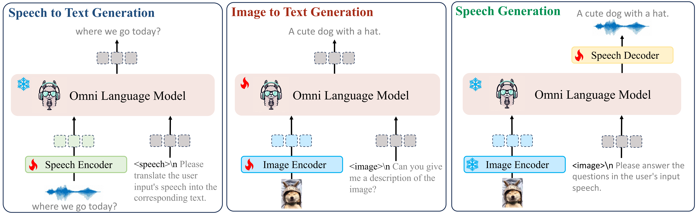

<div align=center>

</div>

# OpenOmni: Advancing Open-Source Omnimodal Large Language Models with Progressive Multimodal Alignment and Real-Time Self-Aware Emotional Speech Synthesis

<font size=5><div align='center' >  [[📖 arXiv Paper](https://arxiv.org/pdf/2501.04561)] [[📊 Datasets](https://huggingface.co/datasets/Tongyi-ConvAI/OpenOmni)] [[🏆 Models](https://huggingface.co/Tongyi-ConvAI/OpenOmni)]  </div></font>
OpenOmni is the end-to-end fully open-sourced pioneering method that successfully incorporates image,speech and text into the omni large language model. OpenOmni's design for speech generation through language bridging and text-guided speech can be quickly trained in situations where omni-modal data and VRAM resources are scarce. OpenOmni not only supports omni-modal nderstanding, but also supports two real-time emotional speech generation modes, CTC mode and AR mode, so that users can flexibly choose according to their needs to achieve a balance between generation speed and quality. The flexible framework design allows OpenOmni to be easily and quickly applied to a variety of downstream tasks, such as speech embodied navigation, multi-role-playing speech dialogue, etc. Everyone is welcome to come and experience it now!

## 🔥 Update
- [2025/09/22]🔥After a year of community evaluation, our work has been accepted by NIPS 2025. Congratulations!
- [2025/05/26]🔥Our [[OmniCharacter](https://github.com/zchoi/OmniCharacter)]—built on MMEvol and OpenOmni series—has been accepted to the main track of ACL 2025. You’re all welcome to give it a try!
- [2025/05/15]🔥Two paper has beed accepted by ACL 2025 main based on our findings (LLaMA-Omin2 and OmniCharacter). We warmly welcome everyone to use our work.
- [2025/05/05]🔥Our gate fusion technology for more acurrate speech content generation is adopted by [LLaMA-Omni2](https://arxiv.org/pdf/2505.02625)
- [2025/02/12]🔥Add some missing file and fix all possible bug
- [2025/01/13]🔥OpenOmni is coming! We release the [code](https://github.com/RainBowLuoCS/OpenOmni), [model](https://huggingface.co/Tongyi-ConvAI/OpenOmni) and [data](https://huggingface.co/datasets/Tongyi-ConvAI/OpenOmni)
- [2025/01/09]🔥After two months of company audit! We release the [paper](https://arxiv.org/pdf/2501.04561)
- [2024/11/14]🔥We submit the [paper](https://arxiv.org/pdf/2501.04561) for peer review [openreview](https://openreview.net/forum?id=4INQLiQboj&noteId=EoIEBpudYc)
- [2024/09/15]🔥We write the first line of OpenOmni project for fully open-sourced pioneering OmniLLM in end-to-end manner.


## <font style="color:rgb(31, 35, 40);">👀</font><font style="color:rgb(31, 35, 40);"> Contents</font>
+ <font style="color:rgb(31, 35, 40);">Setup</font>
+ <font style="color:rgb(31, 35, 40);">Model</font>
+ <font style="color:rgb(31, 35, 40);">Preparation</font>
+ <font style="color:rgb(31, 35, 40);">Train</font>
+ <font style="color:rgb(31, 35, 40);">Evaluation</font>
+ <font style="color:rgb(31, 35, 40);">Example</font>
+ <font style="color:rgb(31, 35, 40);">Citation</font>

## <font style="color:rgb(31, 35, 40);">📷</font><font style="color:rgb(31, 35, 40);"> Setup</font>
<font style="color:rgb(31, 35, 40);">Please follow the instructions below to install the required packages.</font>

1. <font style="color:rgb(31, 35, 40);">Clone this repository</font>

```plain
git clone https://github.com/RainBowLuoCS/OpenOmni.git
cd OpenOmni
```

1. <font style="color:rgb(31, 35, 40);">Install Package</font>

```plain
conda create -n openomni python=3.10 -y
conda activate openomni
pip install --upgrade pip  # enable PEP 660 support
pip install -e ".[train]"
pip install -r requirements.txt
```

1. <font style="color:rgb(31, 35, 40);">Install additional packages for training</font>

```plain
pip install flash-attn --no-build-isolation
```
## 🔥 Fast Usage

After downloading the weights and configuring the paths properly. Two open-sourced speech tokenizer are needed for speech discretization and reconstruction with different vocabulary size!  [CosVoice for 6K CTC Mode](https://github.com/FunAudioLLM/CosyVoice) and [GLM4Voice for 16K AR Mode](https://github.com/THUDM/GLM-4-Voice)

Fast inference for omnimodal input (speech,text,image and video)
```plain
python inference.py
```

Fast interation for omnimodal input (speech,text,image and video)
```plain
python demo.py
```

## <font style="color:rgb(31, 35, 40);">Model</font>


<font style="color:rgb(31, 35, 40);">Here are the pretrained weights and instruction tuning weights</font>

| Stage | <font style="color:rgb(31, 35, 40);">Model</font> | <font style="color:rgb(31, 35, 40);">Speech Projector</font> | <font style="color:rgb(31, 35, 40);">Image</font><br/><font style="color:rgb(31, 35, 40);">Projector</font> | <font style="color:rgb(31, 35, 40);">IT Data</font> | <font style="color:rgb(31, 35, 40);">Download</font> |
| --- | --- | --- | --- | --- | --- |
| 1-1 | <font style="color:rgb(31, 35, 40);">OpenOMNI-Qwen2-7B-Stage1-1</font> | ckpt | ckpt | <font style="color:rgb(31, 35, 40);">openomni_stage1-1.json</font> | ckpt |
| 2-1 | <font style="color:rgb(31, 35, 40);">OpenOMNI-Qwen2-7B-Stage2-1</font> | ckpt | ckpt | <font style="color:rgb(31, 35, 40);">openomni_stage2-1.json</font> | ckpt |
| 2-2 | <font style="color:rgb(31, 35, 40);">OpenOMNI-Qwen2-7B-Stage2-2</font> | ckpt | ckpt | <font style="color:rgb(31, 35, 40);">openomni_stage2-2.json</font> | ckpt |
| 3-1 | <font style="color:rgb(31, 35, 40);">OpenOMNI-Qwen2-7B-Stage3-1</font> | ckpt | ckpt | <font style="color:rgb(31, 35, 40);">openomni_stage3-1.json</font> | ckpt |
| 3-2 | <font style="color:rgb(31, 35, 40);">OpenOMNI-Qwen2-7B-Stage3-2</font> | ckpt | ckpt | <font style="color:rgb(31, 35, 40);">openomni_stage3-2.json</font> | ckpt |


## <font style="color:rgb(31, 35, 40);">Preparation</font>
### <font style="color:rgb(31, 35, 40);">Dataset</font>
<font style="color:rgb(31, 35, 40);">Please follow [MMEvol](https://github.com/AlibabaResearch/DAMO-ConvAI/tree/main/mmevol) to prepare the corresponding images-text datasets. Here we only provide the details of speech-text datasets.</font>

The following is the data directory tree of OpenOmni

### <font style="color:rgb(31, 35, 40);">data structure</font>
```plain
datasets
├── json # data receipe
│   ├── openomni_stage1-1.json # speech2text pretraining
│   ├── openomni_stage2-1.json # image2text pretraining
│   ├── openomni_stage2-2.json # image2text instruction tuning
│   ├── openomni_stage3-1.json # text2speech pretraining
│   ├── openomni_stage3-2.json # text2speech emotional injection
├── asr # classic bilingual speech corpus
│   ├── AISHELL-4
│   ├── LibriSPeech
│   ├── WeNetSpeech
├── audio_en # synthetic english speech corpus for question
├── audio_llava # synthetic bilingual speech corpus for answer
├── audio_zh # synthetic chinese speech corpus for question
├── audio_unit # synthetic bilingual speech corpus for answer
├── audio_prefer # synthetic emotional bilingual speech corpus for answer
├── audio_reject # synthetic emotional bilingual speech corpus for answer
├── audio_ultrachat # synthetic bilingual speech corpus for answer
├── ai2d
│   ├── abc_images
│   ├── annotations
│   ├── images
│   ├── questions
│   └── categories.json
......


```

+ All file/path starting with "audio" are self-synthesized.  
+ DPO contains approximately 9k entries for "prefer" and "reject," covering 9 types of emotions.

More details about data curation can be found in our [paper](https://arxiv.org/pdf/2501.04561).

## <font style="color:rgb(31, 35, 40);">Train</font>
### <font style="color:rgb(31, 35, 40);">Speech2Text Pretrain</font>
<font style="color:rgb(31, 35, 40);">Please download the MMEvol, AIShell-4, LibriSPeech, WeNetSpeech,  OpenOmni Data and organize the data following Preparation before training .  Make sure set up the corresponding train script with correct setting (data path, weight path, and hyper-paramaters)</font>

```plain
bash scripts/train/llama3/speech2text_pretrain.sh
bash scripts/train/qwen2/speech2text_pretrain.sh
```

### <font style="color:rgb(31, 35, 40);">Image2Text Pretrain</font>
<font style="color:rgb(31, 35, 40);">Please make sure you download and organize the data following</font><font style="color:rgb(31, 35, 40);"> </font>[<font style="color:rgb(31, 35, 40);">Preparation</font>](https://github.com/RainBowLuoCS/MMEvol#preparation)<font style="color:rgb(31, 35, 40);"> </font><font style="color:rgb(31, 35, 40);">before training. Make sure set up the corresponding train script with correct setting (data path, weight path, and hyper-paramaters)</font>

```plain
bash scripts/train/llama3/image2text_pretrain.sh
bash scripts/train/qwen2/image2text_pretrain.sh
```

### <font style="color:rgb(31, 35, 40);">Image2Text Instruction Tuning</font>
<font style="color:rgb(31, 35, 40);">Please make sure you download and organize the data following</font><font style="color:rgb(31, 35, 40);"> </font>[<font style="color:rgb(31, 35, 40);">Preparation</font>](https://github.com/RainBowLuoCS/MMEvol#preparation)<font style="color:rgb(31, 35, 40);"> </font><font style="color:rgb(31, 35, 40);">before training. Make sure set up the corresponding train script with correct setting (data path, weight path, and hyper-paramaters)</font>

```plain
bash scripts/train/llama3/image2text_finetune.sh
bash scripts/train/qwen2/image2text_finetue.sh
```

### <font style="color:rgb(31, 35, 40);">Text2Speech Pretrain</font>
<font style="color:rgb(31, 35, 40);">Please make sure you download and organize the data following</font><font style="color:rgb(31, 35, 40);"> </font>[<font style="color:rgb(31, 35, 40);">Preparation</font>](https://github.com/RainBowLuoCS/MMEvol#preparation)<font style="color:rgb(31, 35, 40);"> </font><font style="color:rgb(31, 35, 40);">before training. Make sure set up the corresponding train script with correct setting (data path, weight path, and hyper-paramaters)</font>

```plain
bash scripts/train/llama3/text2speech_ pretrain.sh
bash scripts/train/qwen2/text2speech_ pretrain.sh
```

### <font style="color:rgb(31, 35, 40);">Text2Speech Emotional DPO Tuning</font>
<font style="color:rgb(31, 35, 40);">Please make sure you download and organize the data following</font><font style="color:rgb(31, 35, 40);"> </font>[<font style="color:rgb(31, 35, 40);">Preparation</font>](https://github.com/RainBowLuoCS/MMEvol#preparation)<font style="color:rgb(31, 35, 40);"> </font><font style="color:rgb(31, 35, 40);">before training. Make sure set up the corresponding train script with correct setting (data path, weight path, and hyper-paramaters)</font>

```plain
bash scripts/train/llama3/text2speech_ dpo.sh
bash scripts/train/qwen2/text2speech_ dpo.sh
```

## <font style="color:rgb(31, 35, 40);">Evaluation</font>
### <font style="color:rgb(31, 35, 40);">Dataset</font>
#### <font style="color:rgb(31, 35, 40);">Ensure that your api_base, key and dataset are correctly configured before evaluation.</font>
### <font style="color:rgb(31, 35, 40);">data structure</font>
```plain
datasets
├── json # data receipe
│   ├── aishell2_eval.jsonl # aishell evaluation
│   ├── librispeech_eval.jsonl # image2text pretraining
│   ├── wenetspeech_eval.json # image2text instruction tuning
│   ├── openomni_emotion_val.json 
├── OmniBench # OmniBench
│   ├── mmdata
│   ├── dataset
│   		├── eval.json
├── Ov-Odyssey # Ov-Odyssey Bench
│   ├── av_odyssey_part1.parquet
│   ├── av_odyssey_part2.parquet
│   ├── av_odyssey_part3.parquet
│   ├── av_odyssey_part4.parquet
│   ├── av_odyssey_part5.parquet


```

### <font style="color:rgb(31, 35, 40);">Speech-Text Evaluation </font>
<font style="color:rgb(31, 35, 40);">Make sure set up the corresponding train script with correct setting (data path, weight path, and hyper-paramaters)</font>

```plain
python openomni/eval/llama3/asr_eavl.py
python openomni/eval/qwen2/asr_eavl.py
```

| <font style="color:rgb(31, 35, 40);">Model</font> | <font style="color:rgb(31, 35, 40);">LibriSpeech-test-clean</font> | <font style="color:rgb(31, 35, 40);">LibriSpeech-test-other</font> | <font style="color:rgb(31, 35, 40);">AIShell2-dev</font> | <font style="color:rgb(31, 35, 40);">AIShell2-test</font> | <font style="color:rgb(31, 35, 40);">WeNetSpeech-testnet</font> | <font style="color:rgb(31, 35, 40);">WeNetSpeech-testmeeting</font> |
| --- | --- | --- | --- | --- | --- | --- |
| <font style="color:rgb(31, 35, 40);">VITA</font> | 8.1 | 18.4 | <font style="color:rgb(31, 35, 40);"></font> | <font style="color:rgb(31, 35, 40);"></font> | <font style="color:rgb(31, 35, 40);">12.2</font> | <font style="color:rgb(31, 35, 40);">16.5</font> |
| <font style="color:rgb(31, 35, 40);">EMOVA</font> | 4.0 | 8.6 | <font style="color:rgb(31, 35, 40);">10.6</font> | <font style="color:rgb(31, 35, 40);">10.3</font> | <font style="color:rgb(31, 35, 40);"></font> | <font style="color:rgb(31, 35, 40);"></font> |
| <font style="color:rgb(31, 35, 40);">MINI-OMNI</font> | 4.5 | 9.7 | <font style="color:rgb(31, 35, 40);"></font> | <font style="color:rgb(31, 35, 40);"></font> | <font style="color:rgb(31, 35, 40);"></font> | <font style="color:rgb(31, 35, 40);"></font> |
| <font style="color:rgb(31, 35, 40);">Freeze-Omni</font> | 3.29 | 7.4 | <font style="color:rgb(31, 35, 40);"></font> | <font style="color:rgb(31, 35, 40);"></font> | <font style="color:rgb(31, 35, 40);">8.57</font> | <font style="color:rgb(31, 35, 40);">10.09</font> |
| <font style="color:rgb(31, 35, 40);">ours</font> | 2.57 | 5.6 | <font style="color:rgb(31, 35, 40);">6.81</font> | <font style="color:rgb(31, 35, 40);">6.87</font> | <font style="color:rgb(31, 35, 40);">7.63</font> | <font style="color:rgb(31, 35, 40);"></font> |


### <font style="color:rgb(31, 35, 40);">Image-Text Evaluation </font>
<font style="color:rgb(31, 35, 40);">Refer to MMEvol for detailed OpenCampass Vision Language Evaluation</font>

```plain
# run on all 9 datasets
./script/run_inference.sh OpenOmni-Qwen "MME MMMU_DEV_VAL MathVista_MINI LLaVABench RealWorldQA MMStar MMVet AI2D_TEST OCRBench HallusionBench POPE BLINK" all

# The following are instructions for running on a single dataset
# MME
./script/run_inference.sh OpenOmni-Qwen MME all
# MMMU_DEV_VAL
./script/run_inference.sh OpenOmni-Qwen MMMU_DEV_VAL all
# MathVista_MINI
./script/run_inference.sh OpenOmni-Qwen MathVista_MINI all
.....
```

### <font style="color:rgb(31, 35, 40);">Speech-Text-Image Evaluation </font>
<font style="color:rgb(31, 35, 40);">Please download OmniBench and run the following command</font>

```plain
python openomni/eval/llama3/omni_eavl.py
python openomni/eval/qwen2/omni_eavl.py
```

### <font style="color:rgb(31, 35, 40);">Speech-Text-Image-Video Evaluation </font>
<font style="color:rgb(31, 35, 40);">Please download Ov-Odyssey and run the following command</font>

```plain
python openomni/eval/llama3/ov_odyssey_eavl.py
python openomni/eval/qwen2/ov_odyssey_eavl.py
```

### <font style="color:rgb(31, 35, 40);">Text-Speech Evaluation </font>
```plain
python openomni/eval/llama3/t2s_eavl.py
python openomni/eval/qwen2/t2s_eavl.py
```

### <font style="color:rgb(31, 35, 40);">Emotional Text-Speech Evaluation </font>
```plain
python openomni/eval/llama3/et2s_eavl.py
python openomni/eval/qwen2/et2s_eavl.py
```
## <font style="color:rgb(31, 35, 40);"> 📌 Cases of the text to speech </font>
<table>
<tr>
<td align="center">

**四是四，十是十，十四是十四，四十是四十。**

</td>
<td align="center">

**黑化肥发灰，灰化肥发黑，黑化肥发灰会挥发，灰化肥挥发会发黑。**

</td>
<td align="center">

**吃葡萄不吐葡萄皮，不吃葡萄倒吐葡萄皮。**

</td>
</tr>
<tr>
<td align="center">

[四是四，十是十，十四是十四，四十是四十。](https://github.com/user-attachments/assets/64dcbe0d-6f28-43ce-916e-5aea264f13f0)

</td>
<td align="center">

[黑化肥发灰，灰化肥发黑，黑化肥发灰会挥发，灰化肥挥发会发黑。](https://github.com/user-attachments/assets/996e5ec9-8baa-491d-a731-51d454fca493)

</td>
<td align="center">
  
[吃葡萄不吐葡萄皮，不吃葡萄倒吐葡萄皮。](https://github.com/user-attachments/assets/e7035bc0-1b11-4b9c-9491-e86c289daa2f)

</td>
</tr>
<tr>
<td align="center">

**八百标兵奔北坡，炮兵并排北边跑，炮兵怕把标兵碰，标兵怕碰炮兵炮。**

</td>
<td align="center">

**红凤凰，黄凤凰，粉红凤凰，花凤凰。**

</td>
<td align="center">

**牛郎年年恋刘娘，刘娘念念恋牛郎。**

</td>
</tr>
<tr>
<td align="center">

[八百标兵奔北坡，炮兵并排北边跑，炮兵怕把标兵碰，标兵怕碰炮兵炮。](https://github.com/user-attachments/assets/626c5732-2386-49cb-992c-0bd251af40df)

</td>
<td align="center">

[红凤凰，黄凤凰，粉红凤凰，花凤凰。](https://github.com/user-attachments/assets/2d5e862b-abb1-4656-b80f-1576f730005e)

</td>
<td align="center">

[牛郎年年恋刘娘，刘娘念念恋牛郎。](https://github.com/user-attachments/assets/89207b65-7855-425d-84ae-0badb5c1e73f)

</td>
</tr>
</table>


<table>
<tr>
<td align="center">

**She sells seashells by the seashore.**

</td>
<td align="center">

**Peter Piper picked a peck of pickled peppers.**

</td>
<td align="center">

**Six slippery snails slid slowly seaward.**

</td>
</tr>
<tr>
<td align="center">
  
[en_0.webm](https://github.com/user-attachments/assets/cc61b680-1f80-416e-89f7-418222f2de74)

</td>
<td align="center">
  
[en_1.webm](https://github.com/user-attachments/assets/74c058dd-9674-4832-9a08-fa882a16d539)


</td>
<td align="center">

[en_2.webm](https://github.com/user-attachments/assets/bcdbf12d-c5e0-4373-bc92-625fb61fe9ab)


</td>
</tr>

<tr>
<td align="center">

**Six sleek swans swam swiftly southwards.**

</td>
<td align="center">

**I saw Susie sitting in a shoeshine shop.**

</td>
<td align="center">

**Can you can a can as a canner can can a can?**

</td>
</tr>
<tr>
<td align="center">

[en_3.webm](https://github.com/user-attachments/assets/aab3314f-b03c-4398-a935-e013aac02235)


</td>
<td align="center">

[en_4.webm](https://github.com/user-attachments/assets/6b4cdf14-4a87-4dce-8063-252ef5078428)

</td>
<td align="center">

[en_5.webm](https://github.com/user-attachments/assets/9d0794f0-a36b-415d-a264-8935bbf96921)


</td>
</tr>
</table>

## <font style="color:rgb(31, 35, 40);"> 📌 Cases of the text to emotional speech </font>

<table>
<tr>
<td align="center">

**I am so sad.**

</td>
<td align="center">

**why are you doing this to me.**

</td>
<td align="center">

**what a nice day.**

</td>

</td>
<td align="center">

**i am very scared.**

</td>

</tr>
<tr>
<td align="center">
  
[en_sad.webm](https://github.com/user-attachments/assets/bbc331b3-c9f5-4e74-9e40-6e1ae076cc7d)

</td>


<td align="center">
  
[en_angry.webm](https://github.com/user-attachments/assets/6037574c-5137-475d-8c64-b857398def60)


</td>
<td align="center">

[en_happy.webm](https://github.com/user-attachments/assets/9f39acab-8c3e-4079-a733-0a0f92bbf8aa)


</td>

</td>
<td align="center">

[en_fearful.webm](https://github.com/user-attachments/assets/05f2e9c2-82e3-4483-a19f-df0521527f7b)


</td>
</tr>

<tr>
<td align="center">

**我真的很难过.**

</td>
<td align="center">

**你为什么要这样，我真的很生气.**

</td>
<td align="center">

**今天天气真好.**

</td>

</td>
<td align="center">

**我真有点害怕.**

</td>

</tr>

</tr>
<tr>
<td align="center">
  
[zh_sad.webm](https://github.com/user-attachments/assets/c369c65e-d53a-4296-831c-1c4f5ad29b50)

</td>


<td align="center">
  
[zh_angry.webm](https://github.com/user-attachments/assets/a3a780c1-e93c-42c3-88c5-95713e5658a4)


</td>
<td align="center">

[zh_happy.webm](https://github.com/user-attachments/assets/bbd2010a-2d4a-4804-b2b9-f8bba16f78bf)


</td>

</td>
<td align="center">

[zh_fearful.webm](https://github.com/user-attachments/assets/57b6f540-9e00-4507-90db-338af8eb0c8b)


</td>
</tr>

</table>

## <font style="color:rgb(31, 35, 40);">📚</font><font style="color:rgb(31, 35, 40);">Video Demo</font> 


https://github.com/user-attachments/assets/cd679b7c-9f9d-4631-a1f5-96b1428a8ad4


## <font style="color:rgb(31, 35, 40);">📚</font><font style="color:rgb(31, 35, 40);">Citation</font> 

If you find this repo useful for your research, please consider citing the paper

```
@article{luo2025openomni,
  title={OpenOmni: Large Language Models Pivot Zero-shot Omnimodal Alignment across Language with Real-time Self-Aware Emotional Speech Synthesis},
  author={Luo, Run and Lin, Ting-En and Zhang, Haonan and Wu, Yuchuan and Liu, Xiong and Yang, Min and Li, Yongbin and Chen, Longze and Li, Jiaming and Zhang, Lei and others},
  journal={arXiv preprint arXiv:2501.04561},
  year={2025}
}
```
```
@article{luo2024mmevol,
  title={Mmevol: Empowering multimodal large language models with evol-instruct},
  author={Luo, Run and Zhang, Haonan and Chen, Longze and Lin, Ting-En and Liu, Xiong and Wu, Yuchuan and Yang, Min and Wang, Minzheng and Zeng, Pengpeng and Gao, Lianli and others},
  journal={ACL 2025},
  year={2024}
}
```
```
@article{zhang2025omnicharacter,
  title={OmniCharacter: Towards Immersive Role-Playing Agents with Seamless Speech-Language Personality Interaction},
  author={Zhang, Haonan and Luo, Run and Liu, Xiong and Wu, Yuchuan and Lin, Ting-En and Zeng, Pengpeng and Qu, Qiang and Fang, Feiteng and Yang, Min and Gao, Lianli and others},
  journal={ACL 2025},
  year={2025}
}
```
## <font style="color:rgb(31, 35, 40);">📧 </font><font style="color:rgb(31, 35, 40);">Contact</font> 

if you have any question, please consider following concat for help

- Run Luo — r.luo@siat.ac.cn

- Haonan Zhang — zchiowal@gmail.com


## Acknowledgement

\- [LLaVA](https://github.com/haotian-liu/LLaVA) and [LLaVA-Omni](https://github.com/ictnlp/LLaMA-Omni): the codebase we built upon. Thanks for their brilliant contributions to the community! We just can't wait to use OpenOmni.

\- [VLMEvalKit](https://github.com/open-compass/VLMEvalKit): the amazing open-sourced suit for evaluating various LMMs!

\- [CosVoice](https://github.com/FunAudioLLM/CosyVoice): the amazing open-sourced speech tokenizer for speech discretization and reconstruction with 6k vocabulary size!

\- [GLM4Voice](https://github.com/THUDM/GLM-4-Voice): the amazing open-sourced speech tokenizer for speech discretization and reconstruction with 16k vocabulary size!
